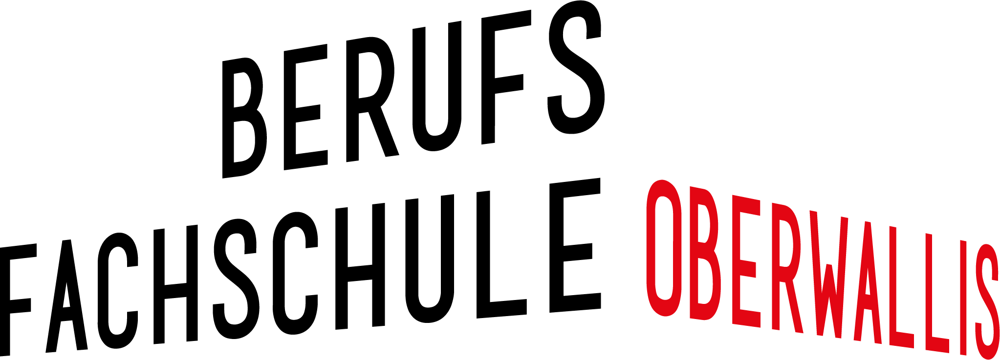

<h1 align="center">
   
  
   
  Promotional Minicourses
   
</h1>

  <a href="#description">Description</a> •
  <a href="#usage">Usage</a> •
  <a href="#credits">Credits</a> •
  <a href="#find-us-on">Find us on</a>

# Description

Practical Minilabor to promote the HES-SO Valais Wallis Engineering School in Sion.

It is intended for the student from EPTM in Sion and BFO in Visp.

  
  

# Usage

## Jupyterbook

This repository also contains the information for building a jupyterbook using the notebooks that are in the `jupyterbook/notebooks` directory.

There is some additional configuration to make this work smoothly and you can read what needs to be done
in [jupyterbook/README.md](jupyterbook/README.md)

For this example, you can see the [online version](https://tschinz.github.io/hei-minicourses) which is automatically built by github using this repository.

# Credits

* [David Tagan](mailto:david.tagan@hevs.ch)
* [Steve Gallay](mailto:stave.gallay@hevs.ch)
* [Dr. Pierre-André Mudry](mailto:pierre-andre.mudry@hevs.ch)
* [Silvan Zahno](mailto:silvan.zahno@hevs.ch)

# Find us on

* Webpage [hevs.ch](https://www.hevs.ch)
* LinkedIn [HES-SO Valais-Wallis](https://www.linkedin.com/groups/104343/)
* Youtube [HES-SO Valais-Wallis](https://www.youtube.com/user/HESSOVS/)
* Twitter [@hessovalais](https://twitter.com/hessovalais)
* Facebook [@hessovalais](https://www.facebook.com/hessovalais)

<!--
## Try out the Nbgitpuller

To make a "binder-like" link to a repository on a droplet that you have set up, you can read the [nbgitpuller documentation](https://jupyterhub.github.io/nbgitpuller/link.html) or fill out a form here:

You can launch this example particular example to try it out by clicking on this link. Your work is persistent.

## Administration tasks

If the hub has a signup page it can be reached here:

And the corresponding page for an admin user to authorise the users after they sign-up is

Admin users also have access to the hub control panel to shut down wayward servers and add / remove users.

-->
    

